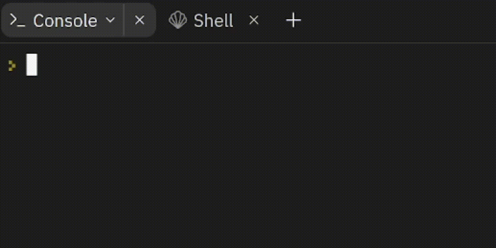

# Welcome to Python!

## Where am I?

Hi! You're looking at this screen cause too many people ask me to teach them Python, and I keep saying yes! So now I have a way to teach them all properly and efficiently so you guys can start a project on your own.

## What do I do?

Most likely, you have little to no knowledge on Python or code in general. That's great; we can start from the beginning. By the end of this guide, you will create a completely functional calculator! Flex on your friends by using that instead of Google!

## Where do I start?

Glad you asked! Here's a list of all the things we will be covering before we start. If you feel comfortable skipping ahead because you have a bit of prior knowledge, that's fine too.

- [Hello World:](hello-world.md)
`print` `input` `\n` `\t`
- [Variables and Datatypes:]()
`int` `float` `str` `bool`
- [Operators and Operands:]()
`+` `-` `>` `<` `=` `==`
- Conditional Statements:
`if` `else` `elif`
- Iteration Methods:
`for` `while`
- Functions:
`def`